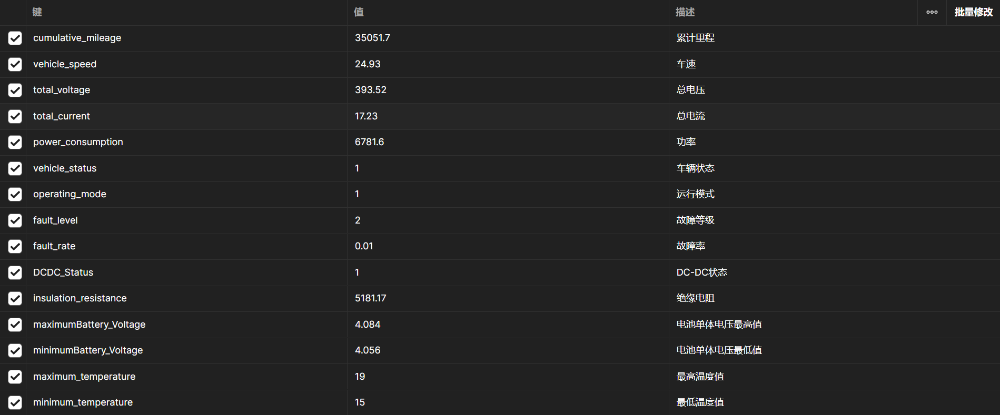

# Electric-car-SOC

### This project is still being updated.

##### 🗺️[简体中文](./README.md)/<u>English</u>

## Project Introduction🪄🪄🪄：

##### This project is used to predict the SOC (State of Charge🔋) value of electric vehicle batteries

##### SOC is a very important indicator used to indicate the current charge level of an electric vehicle battery, usually expressed as a percentage (0% means fully discharged 🪫, 100% means fully charged 🔋)

## Project realization：

- ###### Front-end: Vue3

- ###### Backend: FastAPI

## Project Visualization：

- ###### The front-end is combined with the back-end API interface to visualize training data, adjust training parameters, and predict SOC values.

- ###### You can also directly request the API interface to use it. Currently, the API interface only provides the predicted SOC value. Training and switching models will be added later.

## Interface documentation：

- ##### Predictive SOC interface documentation：

  

